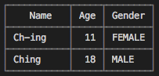

#	pui
__Printable UI for Console__

##  Description

__pui__ is a UI (user interface) toolkit for console. The name *pui* is abbreviation of *Printable User Interface*.


##	ToC

*	[Get Started](#get-started)
*	[Components](#components)
*   [About](#about)
*	[CHANGE LOG](./CHANGELOG.md)
*	[Homepage](https://github.com/YounGoat/nodejs.pui)

##	Get Started

```javascript
// Require the whole toolkit.
const pui = require('pui');

// Or, require a standalone component.
const table = require('pui/table');

const rows = [
    { name: 'Ch-ing', age: 11, gender: 'female' },
    { name: 'Ching', age: 18, gender: 'male' },
];
const columns = [
    { name: 'name', title: 'Name', size: 9 },
    { name: 'age', title: 'Age', align: 'right' },
    { name: 'gender', title: 'Gender', formatter: t => t.toUpperCase() },
];
table.print(rows, { columns });
```

##	Components

*   [__pui/table__](./docs/table.md)  
    Create a printable table or print a table directly in console.   
    

##  About

__pui__ grew out of __[jinang/table](https://www.npmjs.com/package/jinang)__ and __[yuan-console](https://www.npmjs.com/package/yuan-console)__. __jinang__ is an incubator prevent sub modules from depending on 3rd packages. And __yuan-console__ is too heavy for those who only wanna display simple components (e.g. a table or a progress bar) in their cli programs. That is why __pui__ is generated.